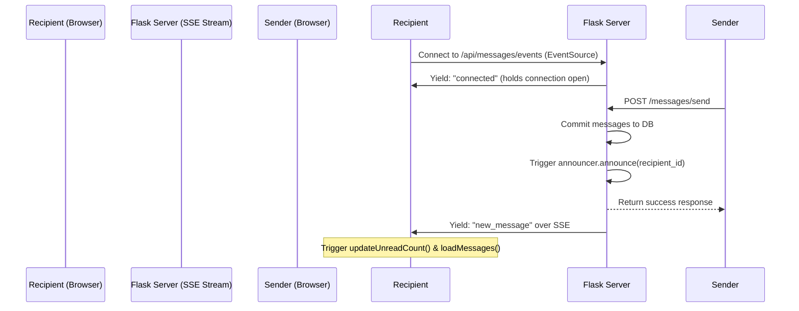

# Mailbox Real-time Event Mechanism

This document records the architectural design for the real-time, event-driven unread message counts and list refresh mechanism inside `vpemaster`.

---

## Architecture Overview

Instead of client-side HTTP polling (which introduces lag and unnecessary database queries), the application uses **Server-Sent Events (SSE)**. This protocol establishes a persistent, unidirectional HTTP connection from the browser to the Flask server, enabling instantaneous updates with minimal resource usage.



---

## 1. Announcer Pattern (Backend)

The event dispatcher is implemented as a thread-safe announcer (`MessageAnnouncer`) located in [app/messages_routes.py](file:///Users/wmu/workspace/toastmasters/vpemaster/app/messages_routes.py):

* **Listener Registration**: When a recipient connects, the announcer creates a thread-safe `queue.Queue` mapped to their `user_id`.
* **Broadcasting**: When a message is successfully committed to the database in `/messages/send`, the announcer loops through all recipient IDs and triggers `announcer.announce(recipient_id, 'new_message')`.
* **Push Delivery**: Active listener queues receive the announcement. If a client disconnects, the event generator removes their queue to prevent memory leaks.

---

## 2. Server-Sent Events Endpoint

The stream endpoint is defined at `/api/messages/events`:
* Uses Flask's `Response(stream_with_context(event_generator()), mimetype='text/event-stream')`.
* Efficiently blocks on `q.get(timeout=25)`.
* Yields periodic keep-alive pings (`data: ping\n\n`) to prevent middleware (e.g. reverse proxies, browsers) from terminating idle connections.

---

## 3. Client-Side EventSource

To avoid establishing multiple redundant SSE connections, the frontend uses a shared connection approach:

### Global Connection (`base.html`)
The main layout initializes a single `EventSource` connection for authenticated users:
```javascript
const messageEventSource = new EventSource('/api/messages/events');
messageEventSource.addEventListener('message', function(event) {
    if (event.data === 'new_message') {
        updateUnreadCount(); // Instantly update header/dropdown unread badges
    }
});
```

### Component Extension (`messages.html`)
Other views (like the mailbox page) reuse the global connection by adding their own event listeners using `addEventListener('message')` instead of overwriting the `onmessage` property:
```javascript
if (typeof messageEventSource !== 'undefined') {
    messageEventSource.addEventListener('message', (event) => {
        if (event.data === 'new_message') {
            loadMessages(currentTab, true); // Instantly update inbox/sent list
        }
    });
}
```

---

## 4. Deployment Requirements (WSGI Server)

Since SSE relies on long-lived open HTTP connections:
* **Development**: Works out of the box using Flask's default development server (`flask run`), which handles concurrent connections via python threading.
* **Production**: Gunicorn's default `sync` worker type blocks one entire worker process per active SSE connection. If there are 4 sync workers, 4 active users will completely block the application.
  * **Solution**: Configure Gunicorn to run with threads (e.g. `--threads` or `gthread` worker-class) in production setups (e.g., in Systemd unit files or Dockerfiles):
    ```bash
    gunicorn -w 2 --threads 50 -b 0.0.0.0:5001 run:app
    ```
